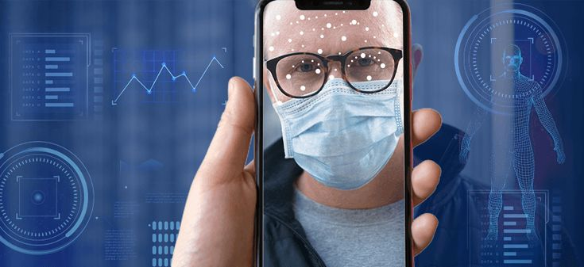

# Face Detection Receptionist
AI-powered Face detection for patients at hospital

<picture>
  
</picture>

## Introduction
Facial recognition technology can be used in healthcare to improve security, automate operations, and provide better patient care.

## Components 
### Software 
OpenCV

Flask for web development

Pickle

Face Recognition

imutils

### Algorithms 
Haarcascade for face detection

### Hardware
Raspberry pi Controller
Raspberry pi camera

## Team members 
Qusay laila
Abed almonem shweiki
